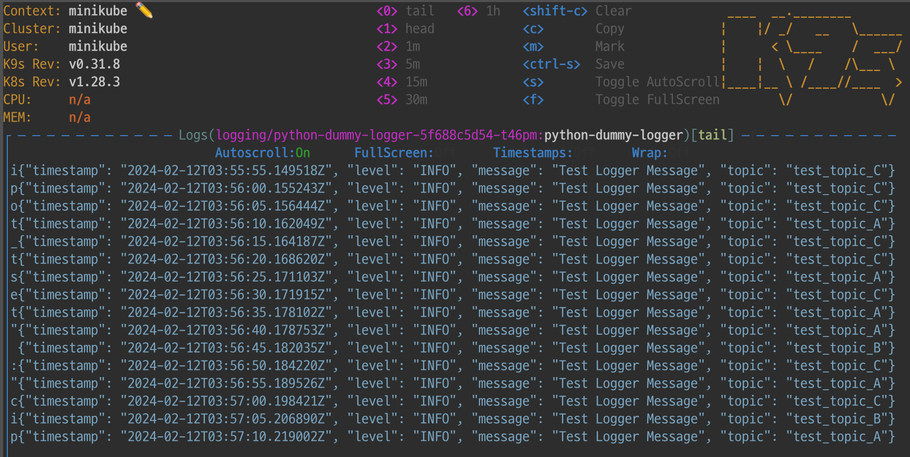

# test_app
- docker 이미지 빌드
    ```
    # Dockerfile과 동일한 경로에서
    docker build -t python-dummy-logger:0.0.1 .
    ```
    - 이미지 빌드전 `eval $(minikube docker-env)` 이용하여 minikube와 docker host를 연결하여 이미지를 가져올수있도록 해준다.
- 이미지 동작 테스트
    ```
    docker run python-dummy-logger:0.0.1
    ```
- minikube와 docker host 연결
    ```
    eval $(minikube -p minikube docker-env)
    ```
    - 연결하지 않은 상태로 생성된 이미지를 kubernetes에 배포하면 이미지 pull 실패하며 `ErrImagePUll` 에러 발생
- docker 이미지를 이용해 kubernetes 배포
    ```
    kubectl create deployment python-dummy-logger --image=python-dummy-logger -n logging
    ```
    - k9s 이용하여 dummy-logger의 출력 확인
    